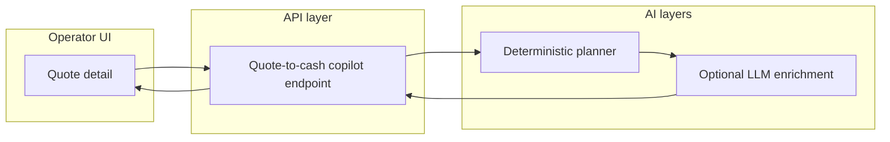

# Technical walkthrough (public-safe)

This document explains **how the hackathon demo works** without exposing proprietary source code, credentials, or tenant data.

## User journey (what you should see in the video)

1. Operator opens **Quotes** in the web app.
2. Opens a **draft** quote on the quote detail page.
3. Clicks **Get AI next-step plan** (wording may vary slightly by build).
4. UI presents:
   - **Summary** of the situation in plain language
   - **Risk flags** that could block conversion or payment
   - **Prioritized next actions** for the operator
   - Optional **customer-ready** messaging assistance

## Architecture (conceptual)

- **Deterministic planner:** produces reliable structured guidance even when LLMs are unavailable.
- **Optional enrichment:** adds narrative polish via an HTTP sidecar pattern; can target an OpenAI-compatible model server (including **vLLM on AMD ROCm** in cloud scenarios).

No secrets appear in client bundles beyond normal authenticated session handling.

## Safety / trust boundaries

- Copilot **recommends** actions; it does **not** autonomously execute payments or change financial records without explicit operator flows.
- Enrichment failures **degrade gracefully** to deterministic output.

## What is intentionally not published here

- Rails/React source trees
- Connector implementations (Xero/QuickBooks/Stripe/etc.)
- Database schemas and migrations
- Production configuration and deploy secrets

See [SECURITY.md](../SECURITY.md).
